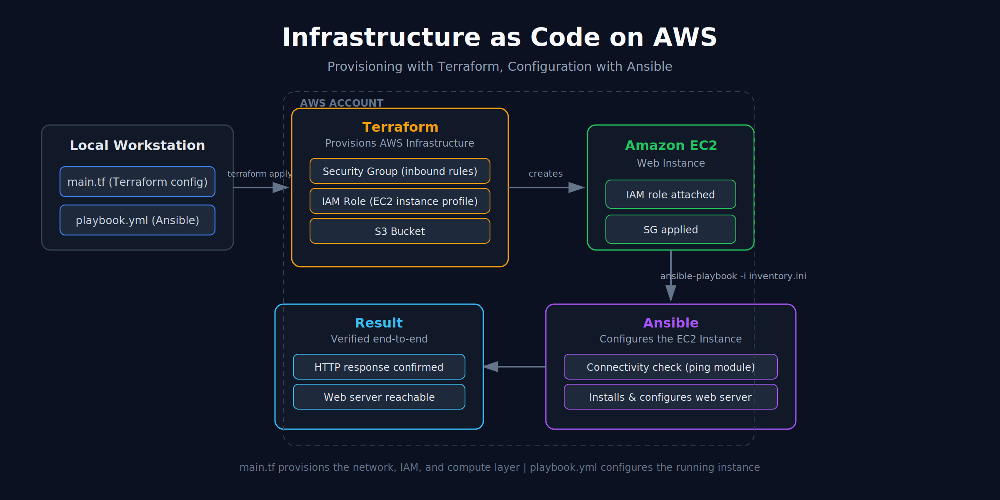
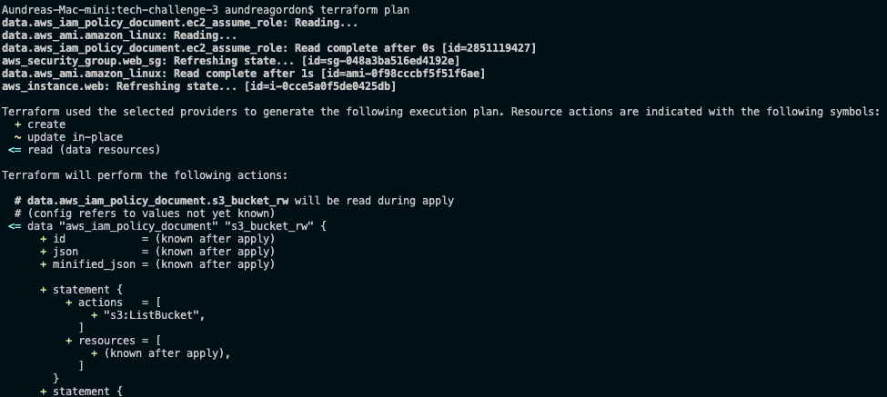
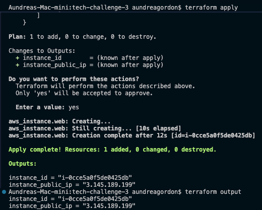
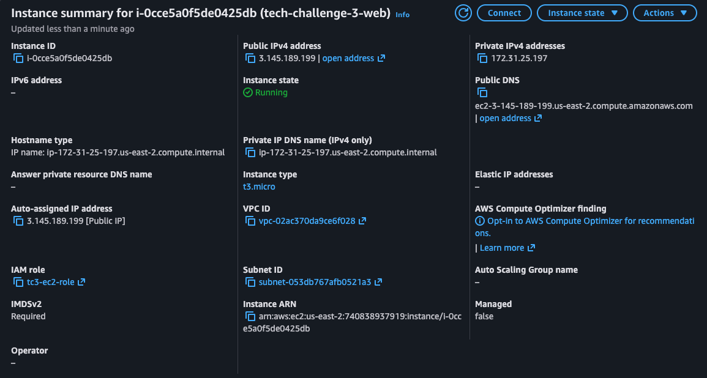
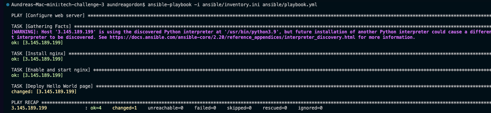
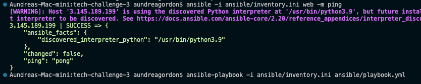
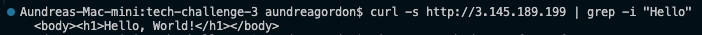
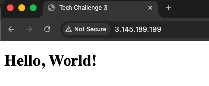

# Infrastructure as Code on AWS: Terraform + Ansible

Provisioning a complete AWS environment with Terraform and configuring the resulting EC2 instance with Ansible — a fully automated, end-to-end IaC workflow from `terraform apply` to a live, verified web server.



## Overview

This project demonstrates a two-layer Infrastructure as Code approach on AWS:

1. **Terraform** provisions the AWS infrastructure — EC2 instance, IAM role, S3 bucket, and security group.
2. **Ansible** configures the running EC2 instance — validating connectivity and deploying the web server configuration.

The result is a repeatable, version-controlled pipeline that takes infrastructure from code to a confirmed, reachable web endpoint with no manual console steps.

## Architecture

| Layer | Tool | Responsibility |
|---|---|---|
| Provisioning | Terraform | EC2 instance, IAM role, S3 bucket, Security Group |
| Configuration | Ansible | Server setup and validation on the provisioned EC2 instance |
| Verification | curl / HTTP | Confirms the web server is live and responding |

## Prerequisites

- AWS account with programmatic access (Access Key ID / Secret Access Key)
- [Terraform](https://developer.hashicorp.com/terraform/downloads) installed locally
- [Ansible](https://docs.ansible.com/ansible/latest/installation_guide/index.html) installed locally
- AWS CLI configured (`aws configure`) or equivalent credentials available to Terraform
- SSH key pair for EC2 access

## Repository Structure

```
.
├── main.tf                    # Terraform configuration (EC2, IAM, S3, Security Group)
├── ansible/
│   ├── inventory.ini          # Ansible inventory pointing to the provisioned EC2 host
│   └── playbook.yml           # Ansible playbook for server configuration
├── images/                    # Architecture diagram and screenshots
└── README.md
```

## Setup & Deployment

### 1. Provision infrastructure with Terraform

```bash
terraform init
terraform plan
terraform apply
```

`terraform init` initializes the working directory and providers. `terraform plan` previews the resources Terraform will create. `terraform apply` provisions the EC2 instance, IAM role, S3 bucket, and security group on AWS.

**Terraform plan output:**


**Terraform apply output:**


**Confirmed resources in the AWS Console:**


### 2. Configure the instance with Ansible

Once the EC2 instance is running, Ansible connects to it and applies the configuration defined in the playbook.

```bash
ansible-playbook -i ansible/inventory.ini ansible/playbook.yml
```

**Playbook execution:**


**Connectivity check:**
```bash
ansible all -i ansible/inventory.ini -m ping
```


### 3. Verify the deployment

```bash
curl http://<ec2-public-ip>/
```

**Confirmed response:**



## Explanation of Terraform and Ansible in This Project

- **Terraform** is responsible for the *infrastructure layer*. `main.tf` defines the EC2 instance, an IAM role and instance profile granting the EC2 instance scoped permissions, an S3 bucket, and a security group with the necessary inbound rules. Running `terraform apply` brings this infrastructure to life in a predictable, declarative, and repeatable way.
- **Ansible** is responsible for the *configuration layer*. Once the EC2 instance exists, `playbook.yml` connects to it (validated first with a `ping` module check) and installs and configures the web server so the instance is actually serving traffic — closing the gap between "infrastructure exists" and "application is running."

Together, they separate provisioning from configuration, which keeps each tool doing what it does best and makes the whole pipeline easier to reason about, re-run, and extend.

## Key Takeaways

- Declarative provisioning with Terraform removes manual console work and makes infrastructure changes reviewable and repeatable.
- Separating provisioning (Terraform) from configuration (Ansible) keeps each layer of the stack independently testable.
- IAM roles scoped to the EC2 instance (rather than long-lived credentials) keep the security posture tight.
- End-to-end verification (ping check → curl response) confirms the pipeline works from infrastructure to application, not just "resources exist."

## Notes on Screenshots

The screenshots referenced above should be added to an `images/` folder at the root of this repository using the filenames listed:

| Filename | Content |
|---|---|
| `architecture-diagram.png` | Architecture diagram of the provisioning/configuration flow |
| `terraform-plan.png` | Output of `terraform plan` |
| `terraform-apply.png` | Output of `terraform apply` |
| `aws-console-resources.png` | AWS Console showing the confirmed, provisioned resources |
| `ansible-playbook-run.png` | Output of running the Ansible playbook |
| `ansible-ping-success.png` | Successful `ansible -m ping` connectivity check |
| `curl-response.png` | Terminal output of `curl` confirming the web server response |
| `web-server-browser.png` | Web server response viewed in the browser |
